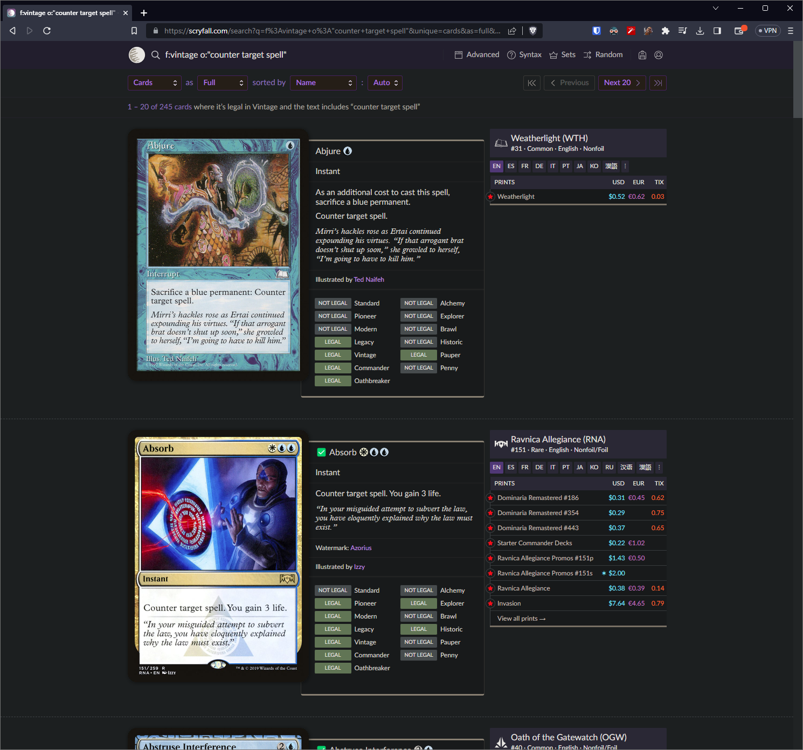

# Jank Scryfall Enhancer
This project is a Chrome browser extension that lets you quickly see if a card
is on the Jank Bulk list or not while browsing [Scryfall](https://scryfall.com).

## Chrome / Brave / Edge etc.
To use this extension with chrome, you must download this repository either as a
zip file and extract the contents or cloning through git. Then, you can add it to
the extensions tab with developer mode on -
[Instructions](https://developer.chrome.com/docs/extensions/mv3/getstarted/development-basics/#load-unpacked)

Chrome store listing TBA.

## Firefox

The extension has been submitted to the add-on developer hub and is awaiting
approval. Release TBD.

## What Does it Do?

This extension works by downloading the official Jank Bulk list database and
seeing if the card names in a "Full" view search are present in it. Cards that
are bulk legal get a "✅" prepended to their name. The extension also works when
viewing an individual card's webpage.

Below is a sample screenshot of the extension in action. In this case, Abjure is
not bulk legal and remains unmodified, but Absorb is cheap enough to be considered
"bulk" and gets a check mark in front of its name:

Experiencing issues? Feel free to make a ticket in the issues tab and let me
know what's happening.
